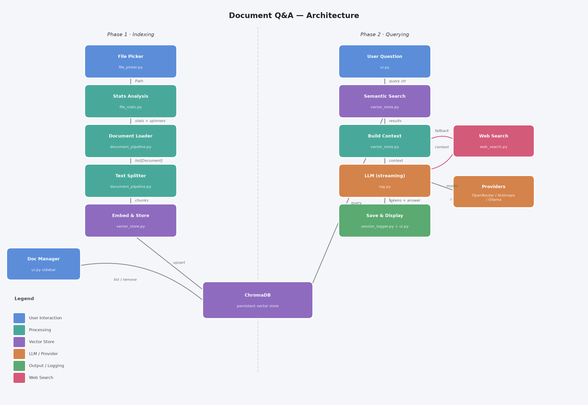

# Document Q&A

A desktop application that lets you select a PDF, Word, or text document, index it into a local vector database, and ask questions about it in natural language. Answers stream in real time, every session is saved automatically, and the full pipeline is built as a composable chain where each step is independently replaceable.

> **This app is a well-structured RAG pipeline with agentic-inspired architecture — composable units, conversation memory, and automatic fallback — where each module is an independent, replaceable step in the chain.**

---

## Architecture



The application is built around a **compositional pipeline** — every step is a small, single-purpose unit connected to the next by a chain. This makes each piece independently testable, replaceable, and reusable.

### Phase 1 · Indexing

| Step | File | Input → Output |
|---|---|---|
| **File Picker** | `file_picker.py` | button click → `Path` |
| **Stats Analysis** | `file_stats.py` | `Path` → size, char count, word count, language, recommended settings |
| **Document Loader** | `document_pipeline.py` | `Path` → `list[Document]` |
| **Text Splitter** | `document_pipeline.py` | `list[Document]` → chunks |
| **Embed & Store** | `vector_store.py` | chunks → ChromaDB (upsert with embeddings) |

```python
index_chain = make_document_chain(chunk_size, chunk_overlap) | store_chain
index_chain.invoke(file_path)
```

### Phase 2 · Querying

| Step | File | Input → Output |
|---|---|---|
| **User Question** | `ui.py` | text input → query string |
| **Semantic Search** | `vector_store.py` | query → top-N matching chunks |
| **Build Context** | `vector_store.py` | chunks → plain text + source list |
| **LLM (streaming)** | `rag.py` | context + history + question → streamed tokens |
| **Save & Display** | `session_logger.py` + `ui.py` | answer → screen + `.txt` |

If semantic search returns no context, an optional **Web Search fallback** (`web_search.py`) queries DuckDuckGo and answers from web results instead.

### Why this design?

> Each file does exactly one thing and hands its output to the next step. No file needs to know what comes before or after it.

- **Testable** — call `analyze_file(path)` or `store_chain.invoke(docs)` in isolation
- **Replaceable** — swap ChromaDB for Pinecone without touching `rag.py`; swap the LLM without touching `vector_store.py`
- **Extendable** — add a translation step, a citation highlighter, or a router agent by inserting one more unit in the chain

### Is this Agentic AI?

Partially. The architecture is agentic-inspired — each module is an autonomous unit, the system has memory, and it falls back to web search automatically. But the orchestration is done by Python code, not by the LLM itself. In a fully agentic system, the LLM would decide which tools to call and when, using a ReAct loop. That is the natural next step for this project.

| Capability | This app | Fully agentic |
|---|---|---|
| Composable pipeline | ✅ | ✅ |
| Conversation memory | ✅ | ✅ |
| Web search fallback | ✅ (code-triggered) | ✅ (LLM-triggered) |
| Tool selection by LLM | ❌ | ✅ |
| Multi-step reasoning loop | ❌ | ✅ |

---

## Features

### Document handling
- Native file picker with full Persian/Arabic filename support (via `zenity`)
- Supports `.pdf`, `.docx`, `.doc`, `.txt`
- Automatic file statistics on load: size, character count, word count, detected language
- Auto-recommended chunk size and overlap based on document length
- Persistent vector store — indexed documents survive app restarts
- **Double-click** any indexed document in the sidebar to select it without re-indexing

### Q&A
- **Streaming answers** — tokens appear in real time as the LLM generates them
- **Conversation memory** — the LLM remembers the last 3 turns for follow-up questions
- **Web search fallback** — if no relevant context is found in the document, optionally search DuckDuckGo (toggle with `?` help tip)
- **Spinning progress indicator** — visible from click until the first token arrives
- Question history dropdown with fuzzy search across all previous sessions

### LLM providers
Switch between providers from the toolbar without restarting:

| Provider | Models |
|---|---|
| **OpenRouter** | `gpt-oss-120b:free`, `claude-3-haiku`, `gemini-flash-1.5-8b`, `llama-3.1-8b:free` |
| **Anthropic** | `claude-sonnet-4-6`, `claude-haiku-4-5` |
| **Ollama (local)** | `llama3.2`, `mistral`, `qwen2.5`, `phi3` |

Automatic retry with exponential backoff on rate-limit errors (5s → 15s → 30s).

### Session management
- All Q&A sessions saved automatically to `qa_sessions/<document_name>/<document_name>_<date>.txt`
- Document management sidebar — list all indexed documents, remove or select individual ones

### UI
- Dark mode toggle
- Animated circular spinner while waiting for a response
- Logs panel for live status messages
- Configurable chunk size, overlap, result count, and web fallback — each with a `?` help tooltip
- Selecting a new file clears the previous answer automatically
- Full RTL / Persian / Arabic text support (PyQt6 + Noto Naskh Arabic font)

---

## Project Structure

```
.
├── main.py                    # entry point
├── ui.py                      # PyQt6 interface (toolbar, doc panel, Q&A panel)
├── file_picker.py             # native file dialog (zenity / tkinter fallback)
├── file_stats.py              # char count, language detection, chunk recommendations
├── document_pipeline.py       # LangChain loader + text splitter chain factory
├── vector_store.py            # ChromaDB: store, search, list, remove documents
├── rag.py                     # PROVIDERS, streaming LLM calls, RAG answer
├── web_search.py              # DuckDuckGo fallback search
├── session_logger.py          # Q&A session writer + HTML export
├── generate_architecture.py   # script to regenerate Architecture.png
├── Architecture.png
├── chroma_db/                 # persistent vector database (auto-created)
└── qa_sessions/               # saved Q&A logs (auto-created)
    └── <document_name>/
        └── <document_name>_<YYYY-MM-DD_HH-MM-SS>.txt
```

---

## Setup

**1. Install dependencies**

```bash
uv sync
```

**2. Create a `.env` file**

```env
OPEN_ROUTER_API_KEY=your_key_here
OPEN_ROUTER_MODEL=openai/gpt-oss-120b:free

# optional — only needed if you select these providers in the UI
ANTHROPIC_API_KEY=your_key_here
```

Get a free OpenRouter key at [openrouter.ai](https://openrouter.ai).

**3. Run**

```bash
uv run python main.py
```

---

## System requirements

- Python 3.11+
- `zenity` for the file picker on Linux — `sudo apt install zenity`
- `fonts-noto` for Persian/Arabic rendering — `sudo apt install fonts-noto`
- For **Ollama**: install from [ollama.com](https://ollama.com) and pull a model before selecting it in the UI

---

## Multilingual support

The app works with any language:

- The embedding model (`all-MiniLM-L6-v2`) is multilingual — semantic search works across languages
- The LLM is instructed to **answer in the same language as the question**
- The UI renders RTL text (Persian, Arabic, Hebrew, Urdu) correctly throughout
